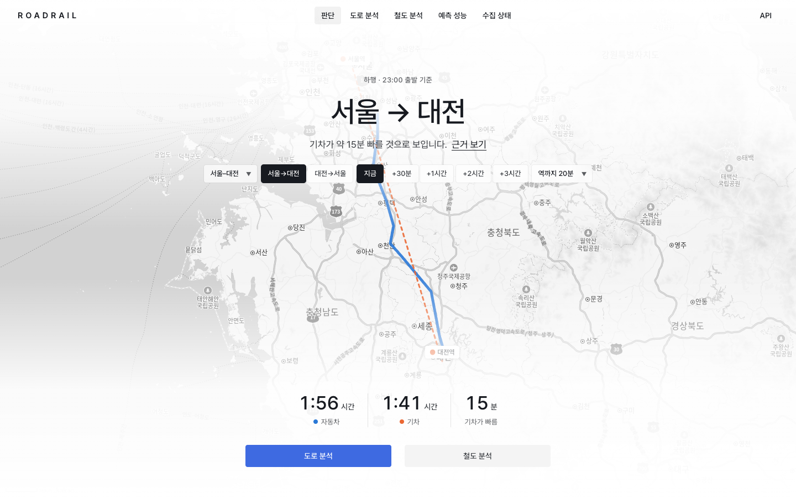
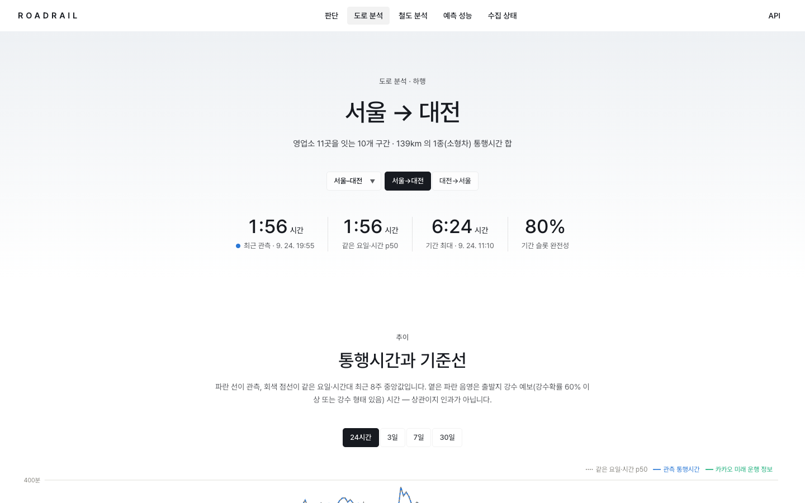
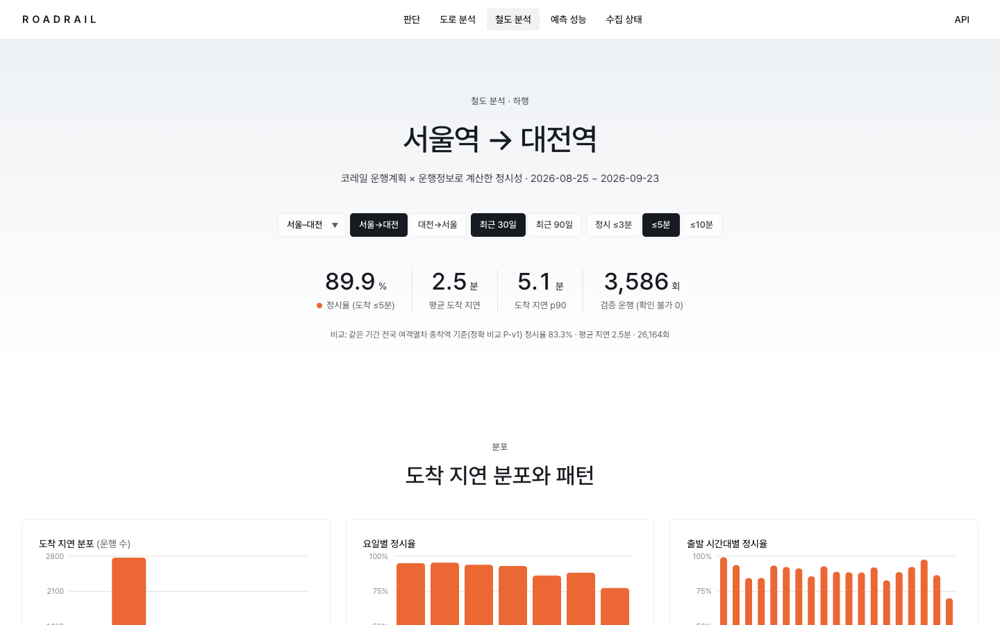
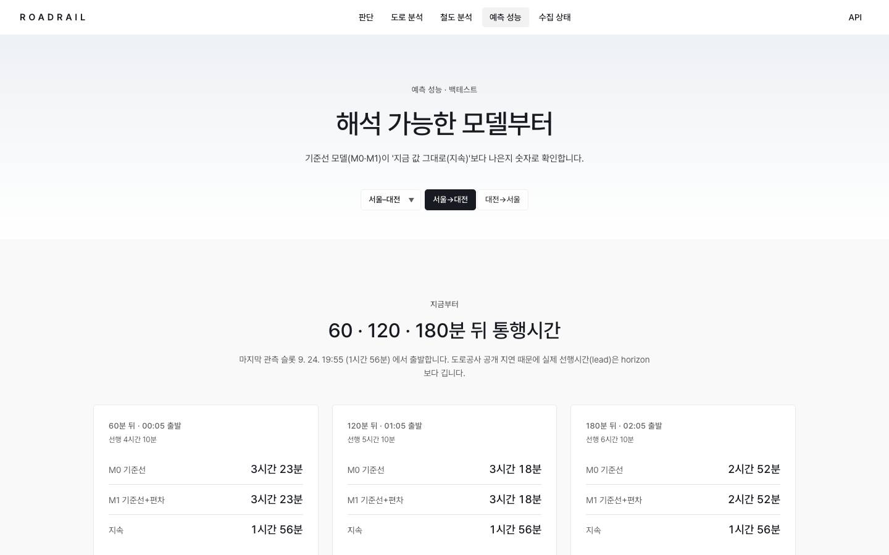
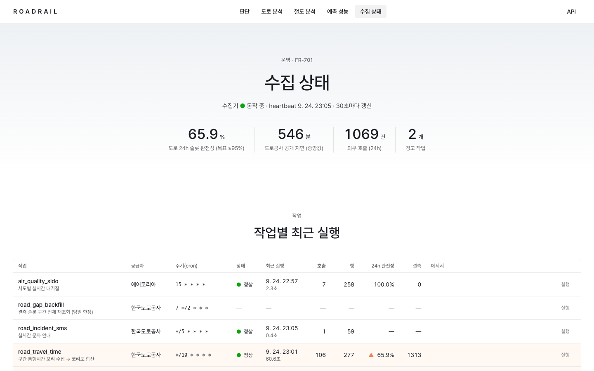
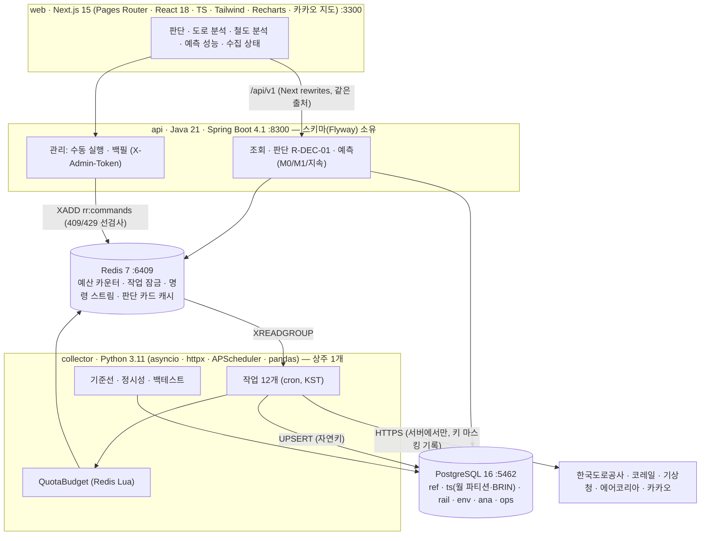
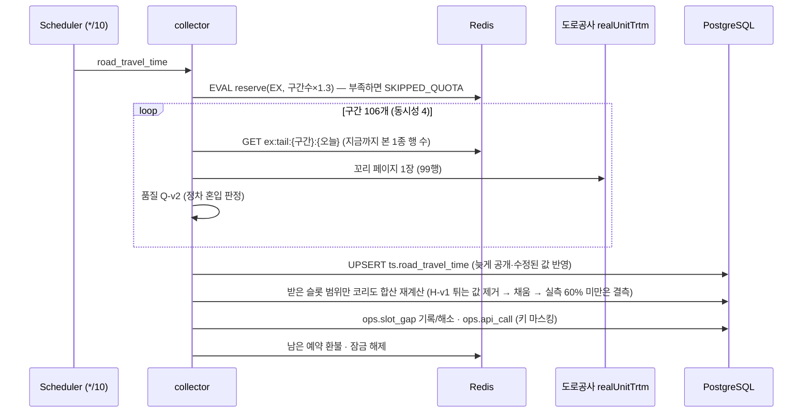

# 로드레일 (RoadRail)

**고속도로·열차 이동 판단 & 정시성 분석.**
자주 오가는 도시 구간(코리도)마다 고속도로 영업소 간 통행시간을 5분 슬롯으로 쌓고, 코레일 운행계획·운행정보로 열차 정시성을 계산해,
날씨·대기질과 함께 **"지금 차로 갈까, 기차로 갈까"를 근거와 함께** 보여 주는 로컬 시계열 분석 서비스입니다.

> ⚠ 공공데이터 기반 **참고 정보**이며 교통 안내(내비게이션) 서비스가 아닙니다. 모든 수치에는 데이터 시각과 표본 수를 함께 표시하고, 값이 없으면 '—' 로 표시합니다.



<table>
<tr>
<td width="50%"><br><sub><b>도로 분석</b> · 2026-09-24 추석 귀성길: 서울→대전 하행이 11시 무렵 6시간 24분까지 오른 뒤 풀리는 실측 곡선, 기준선·강수 예보·카카오 ETA</sub></td>
<td width="50%"><br><sub><b>철도 분석</b> · 서울역→대전역 최근 30일 정시율 89.9% (3,586회) · 지연 분포 · 요일·시간대별 · 열차 랭킹</sub></td>
</tr>
<tr>
<td><br><sub><b>예측 성능</b> · M0 기준선 · M1 기준선+편차 · 지속 모델, 선행시간(lead)과 기준선 표본 수, 누수 없는 백테스트 MAE</sub></td>
<td><br><sub><b>수집 상태</b> · 작업별 최근 실행 · 24h 완전성 · 공급자별 호출 예산 · 공개 지연 · 실행 이력</sub></td>
</tr>
</table>

<sub>2026-09-24(추석 연휴 첫날) 로컬 실데이터로 찍은 화면입니다. 다시 찍기: `make capture`. UI 는 테슬라 홈페이지 톤의 라이트 모드(전체 화면 히어로 · 스펙 숫자 · 264px 버튼 두 개 · 투명 상단 바)입니다.</sub>

---

## 이 프로젝트에서 보여 주려는 것

| 주제 | 구현 | 확인 방법 |
|---|---|---|
| **실데이터 탐색으로 설계 확정** | W1 스모크로 기획서의 미결정 사항 U-1~U-5 를 실측으로 닫고, 새로 발견한 U-6(향후 운행계획 미제공)을 설계에 반영 | [docs/W1-smoke.md](docs/W1-smoke.md) · `fixtures/` 계약 테스트 |
| **호출 한도가 있는 수집** | 공급자별 일일 예산을 Redis Lua 로 원자 예약 → 호출마다 차감 → 환불. 부족하면 호출 없이 `SKIPPED_QUOTA` | `test_concurrent_reservations_never_exceed_limit` — 동시 20개 × 30건, 한도 500 → 정확히 16개 |
| **늦게 공개되는 시계열** | 도로공사 통행시간은 하루 전체를 99행씩 · 약 3시간 늦게 공개 → 구간별 '꼬리 커서'로 10분마다 1페이지만, 자연키 UPSERT 로 늦은 값 반영 ([ADR-008](docs/adr/008-tail-cursor-and-segment-chain.md)) | `test_tail_cursor_fetches_only_from_last_seen_page` · `/ops` 공개 지연 |
| **결측 탐지 · 백필** | 코리도 슬롯 결측(`LOW_COVERAGE` · `NO_DATA`)을 기록하고 당일 안에서 전체 재조회로 해소, 지난 날짜는 `SOURCE_EXPIRED` | `test_missing_slot_is_recorded_then_backfilled` |
| **데이터 품질 규칙의 진화** | 휴게소 정차 혼입을 거르던 규칙 Q-v1 이 **추석 실제 정체**를 오류로 잘못 거른 것을 발견 → Q-v2 + Hampel 형 필터 H-v1, 저장 데이터 무호출 재분류 ([ADR-012](docs/adr/012-road-quality-rule.md)) | SUSPECT 1,132 → 44행 · `test_real_congestion_even_fastest_is_slow_is_ok` |
| **정시성 계산** | 계획(시발·종착) × 실제(역별)로 정확 비교(P-v1), 중간역은 지연 보간(P-i1, ⚠ 추정), 운행정보 없는 열차는 분모 제외 | 9개 단위 테스트 (자정 넘김 · 조기 도착 · 확인 불가) |
| **언어 간 계약** | 같은 예측 식을 Python(백테스트)과 Java(판단 카드)가 구현 → `fixtures/forecast_cases.json` 골든 케이스를 양쪽 테스트가 공유, 반올림까지 통일 | `test_golden_cases` · `ForecastModelsGoldenTest` |
| **누수 없는 백테스트** | 발행일마다 그 이전 8주로만 기준선 재계산, 입력 기간·모델 버전 저장, 재실행 결정성 | `test_backtest_is_deterministic` · 규칙적 러시아워 합성 시계열에서 M0·M1 < 지속 |
| **근거 있는 판단** | R-DEC-01 순수 함수: 결론 + 사용한 수치·데이터 시각 목록, 한쪽 데이터가 없으면 결론 대신 '비교할 수 없습니다' | `DecisionRuleTest` 5개 |
| **응답 시간 예산** | 판단 카드 Redis 60초 캐시 + 카카오 ETA 비동기·최대 0.6초 대기 ([ADR-010](docs/adr/010-kakao-bounded-wait.md)) | 미적중 0.52~0.82초 · 적중 7~9ms (NFR-03) |
| **실데이터 검증** | 실제 API 로 전체를 돌리며 11개 문제를 재현 → 수정 → 회귀 테스트로 고정 | [docs/VERIFICATION.md](docs/VERIFICATION.md) |

---

## 1. 처음 실행하기 (맥 · Docker Desktop)

```bash
cd ~/Projects/roadrail
cp .env.example .env      # 키 입력 (make up 은 .env 가 없으면 만들고 ADMIN_TOKEN 도 생성)
make smoke                # 키 5종이 실제로 동작하는지 확인 (10개 오퍼레이션)
make up                   # db · redis · api · collector · web 기동 (처음 빌드 약 3분)
open http://localhost:3300
```

첫 기동 때 수집기가 자동으로 톨게이트 590개 동기화 → 도로·기상·대기·카카오 첫 수집 → **철도 92일 백필(276회 호출, 약 3분, 운행정보 83만 행)** → 기준선·백테스트를 실행합니다.

`.env` 에 넣는 값 (**값 뒤에 줄 끝 주석을 달지 마세요** — docker compose 가 값으로 읽습니다):

| 변수 | 발급처 | 용도 |
|---|---|---|
| `EX_API_KEY` | 고속도로 공공데이터 포털 (data.ex.co.kr) | 영업소 간 통행시간 · 전국 교통량 · 문자 안내 · 톨게이트 |
| `DATA_GO_KR_KEY` | 공공데이터포털 일반 인증키 (Decoding) | 코레일 열차운행정보 v2 · 기상청 단기예보 · 에어코리아 |
| `KAKAO_REST_API_KEY` | 카카오 REST 키 | 역 좌표 보정(로컬) · 미래 운행 정보 길찾기(모빌리티) |
| `NEXT_PUBLIC_KAKAO_JS_KEY` | 카카오 JavaScript 키 (플랫폼 Web 도메인에 `http://localhost:3300`) | 지도. 없으면 SVG 노선도로 대체 |
| `ADMIN_TOKEN` | `make up` 이 자동 생성 | 관리 API (`X-Admin-Token`) |

| 주소 | 내용 |
|---|---|
| http://localhost:3300 | 화면: 판단 · 도로 분석 · 철도 분석 · 예측 성능 · 수집 상태 |
| http://localhost:8300/docs | API 문서 (springdoc Swagger UI) |

그 밖의 명령: `make ps` · `make logs` · `make collect-once JOB=road_travel_time` · `make rail-backfill FROM=… TO=…` · `make reclassify` · `make test` · `make e2e` · `make psql` · `make reset`

---

## 2. 아키텍처





### 기술 스택

| 영역 | 선택 | 메모 |
|---|---|---|
| 수집 · 분석 | Python 3.11 · asyncio · httpx · APScheduler · psycopg 3 · pandas | 공급자 어댑터 5종 · 작업 12개 · CLI (`roadrail …`) |
| API | Java 21 · **Spring Boot 4.1.1** · JdbcClient · Flyway · Spring Data Redis · springdoc | 3.4 는 OSS 지원 종료 → 4.1 ([ADR-007](docs/adr/007-polyglot-stack.md)). 가상 스레드 |
| 화면 | Next.js 15 (Pages Router) · React 18 · TypeScript · Tailwind · Recharts 3 · 카카오 지도 | 테슬라 톤 라이트 모드. 차트 팔레트는 CVD 검증(ΔE 9.2) |
| 저장 | PostgreSQL 16 (월 파티션 · BRIN) · Redis 7 | 6 스키마 · 25 테이블 |
| 테스트 | pytest · JUnit 5 · Testcontainers · MockMvc · Playwright | 아래 7장 |
| 운영 | Docker Compose · Makefile · GitHub Actions | 모든 포트 127.0.0.1 바인딩 |
| 도입하지 않음 | Kafka/CDC · ClickHouse/BigQuery · Kubernetes | 이유와 도입 조건: [ADR-011](docs/adr/011-out-of-scope-infra.md) |

---

## 3. 코리도와 데이터

| 코리도 | 고속도로 (하행 체인) | 철도 |
|---|---|---|
| 서울–대전 `SEL-DJN` | 서울TG→대전 · 10구간 · 139km | 서울역–대전역 |
| 서울–천안 `SEL-CAN` | 서울→천안 · 6구간 · 71km | 서울역–천안아산역 |
| 서울–대구 `SEL-DGU` | 서울→북대구 · 18구간 · 282km | 서울역–동대구역 |
| 서울–부산 `SEL-BSN` | 서울→부산 · 25구간 · 422km | 서울역–부산역 |
| 대전–대구 `DJN-DGU` | 대전→북대구 · 8구간 | 대전역–동대구역 |
| 대구–부산 `DGU-BSN` | 북대구→부산 | 동대구역–부산역 |
| 서울–목포 `SEL-MKP` | 서서울→목포 (서해안선) · 14구간 · 343km | 용산역–목포역 |
| 서울–강릉 `SEL-GNG` | 서울→강릉 (경부·영동선) · 15구간 · 218km | 서울역–강릉역 |

구간 체인은 `tools/build_seed.py` 가 만듭니다 — `updownIcList` 는 영업소를 코드 순으로 주므로 좌표를 출발→도착 벡터에 투영해 순서를 매기고,
후보마다 `realUnitTrtm` 오늘 행 수로 표본을 확인하며 한 칸씩 전진합니다(데이터가 없는 쌍은 되돌아가 다른 후보). 결과는 `seed/corridors.yaml` (멱등 적용).

| 작업 | 공급자 | 주기 | 호출/일 |
|---|---|---|---|
| `road_travel_time` | 도로공사 | 10분 | ≈ 15,300 (구간 106 × 144) |
| `road_gap_backfill` | 도로공사 | 2시간 | 결측 있을 때만 |
| `road_volume_all` · `road_incident_sms` | 도로공사 | 15분 · 5분 | 96 · 288 |
| `rail_daily` | 코레일 | 03:30 | 3 (계획 1 + 운행정보 2, 누락일은 최대 7일 누적 재시도) |
| `weather_vilage` | 기상청 | 발표 +15분 (8회) | 격자 7 × 8 = 56 (같은 발표는 다시 받지 않음) |
| `air_quality_sido` | 에어코리아 | 매시 15분 | 시도 7 × 24 = 168 (**한도 500**, 예산 450) |
| `kakao_eta` | 카카오 | 매시 20분 | 16 × 24 = 384 (교차검증용) |
| `baseline_daily` · `backtest_daily` · `maintenance` | — | 04:30 · 04:45 · 매월 25일 | 0 |

---

## 4. 계산 · 판단 로직

- **코리도 통행시간** = Σ 구간 통행시간 (1종 소형차, 도착기준 5분 슬롯). 구간 값이 없거나 제외되면 ±15분 최근접 → 24시간 중앙값 → 자유속도 순으로 채우고(`FILLED`), 실측 비율 60% 미만 슬롯은 결측.
- **품질 Q-v2 · H-v1** — [ADR-012](docs/adr/012-road-quality-rule.md).
- **기준선** — 코리도·방향·요일·슬롯별 최근 8주 p50·p90, 표본 n. n<4 이면 전체 요일 기준선으로 대체하고, 편차(%) 비교는 하지 않음(FR-402).
- **예측** — M0 = 기준선, M1 = M0(목표) + (현재 − M0(현재 슬롯)) × e^(−h/90분), 지속 = 현재. 도로공사 공개 지연 때문에 선행시간 h = 목표 − **마지막 관측 슬롯**.
- **정시성** — P-v1: 시발 출발·종착 도착을 계획과 정확 비교, 정시 = 도착 지연 ≤ 5분(설정). P-i1: 중간역은 시발 출발 지연 d0 와 종착 도착 지연 d1 사이를 운행 경과시간 비율로 선형 보간(⚠ 추정).
- **판단 R-DEC-01** — 자동차 = 도로 예측 + IC 접근(기본 0) / 기차 = 역 접근(기본 20분) + 대기 + 계획 소요 + 30일 평균 도착 지연, '출발 + 역 접근' 이후 첫 열차. |차이| < 10분이면 '비슷함'. 경고: 강수확률 ≥ 60% · 코리도 돌발 · 초미세먼지 나쁨 이상.
- **다음 열차** — 코레일 API 가 향후 운행계획을 주지 않으므로(U-6) 목표일과 같은 요일의 가장 최근 운행일 시간표로 추정하고 기준일을 표시.

## 5. API (http://localhost:8300/api/v1 · 문서 `/docs`)

| # | 메서드 · 경로 | 설명 |
|---|---|---|
| 1 | `GET /health` | DB · Redis · 수집기 heartbeat |
| 2 | `GET /corridors` | 코리도 목록 (구간 체인 · 역 · 환경 지점 좌표) |
| 3 | `GET /corridors/{id}/now?dir&departIn&accessMin&carAccessMin` | 판단 카드 — road · rail · env · incidents · decision · freshness · caveat (`X-Cache`) |
| 4 | `GET /corridors/{id}/road/series?dir&from&to&agg=5m\|1h` | 통행시간 시계열 + 기준선 + 강수 예보 + 카카오 ETA |
| 5 | `GET /corridors/{id}/road/baseline?dir` | 요일×슬롯 기준선 (히트맵) |
| 6 | `GET /corridors/{id}/road/forecast?dir&horizons` | M0 · M1 · 지속 예측 + 최근 백테스트 |
| 7 | `GET /corridors/{id}/rail/trains?dir&date` | 날짜별 코리도 열차 + 열차별 30일 정시성 |
| 8 | `GET /rail/punctuality?corridorId&from&to&dir&groupBy=train\|dow\|hour&thresholdMin` | 정시율 집계 · 지연 분포 · 전국 비교 |
| 9 | `GET /corridors/{id}/env?hours` | 지점별 시간별 예보 · 대기질 |
| 10 | `GET /incidents?corridorId&since` | 돌발 문자 안내 (코리도 매칭 M-v1) |
| 11 | `GET /ops/collect-status` | 작업별 상태 · 24h 완전성 · 예산 · 공개 지연 · 오류 |
| 12 | `POST /admin/jobs/{job}/run` | 즉시 실행 202 · 실행 중 409 |
| 13 | `POST /admin/backfill` | 기간 재수집 202 (예상 호출 수 먼저 계산) · 기간 400 · 예산 429 · 실행 중 409 |

오류 규약: `{code, message, traceId}` — `VALIDATION_ERROR` 400 · `UNAUTHORIZED` 401 · `CORRIDOR_NOT_FOUND` 404 · `JOB_RUNNING` 409 · `QUOTA_EXHAUSTED` 429. 시각은 ISO-8601(+09:00), 소요시간은 `Sec`/`Min` 접미사.

## 6. 데이터 모델

`ref`(코리도 · 구간 체인 · 영업소 · 역 · 환경 지점) · `ts`(구간 통행시간 · 코리도 합산 · 교통량 — 월 파티션 + BRIN, 돌발 문자) ·
`rail`(운행계획 · 운행정보(월 파티션) · 열차 정시성 · 코리도 운행) · `env`(단기예보(월 파티션) · 대기질) ·
`ana`(기준선 · 백테스트 · 카카오 ETA) · `ops`(작업 · 실행 이력 · 예산 · 결측 · 호출 로그 · 백필). DDL: [db/migrations](db/migrations).

## 7. 테스트

| 층 | 대상 | 수 |
|---|---|---|
| 단위 (pytest) | 슬롯 정렬 · 격자 변환(기상청 격자표 4곳) · 품질 규칙 · 튀는 값 제거 · 코리도 합산 · 정시성(자정 넘김 · 조기 도착 · 확인 불가 · 보간) · 예측 골든 · 기준선 · 백테스트(결정성 · 누수 없음) · 돌발 매칭 | 43 |
| 계약 (pytest) | 공급자 5종 실제 응답 fixture 파서 | 8 |
| 통합 (pytest + PostgreSQL · Redis) | 예산 동시성 · 멱등 수집 · 꼬리 커서 · 결측→백필 · seed 멱등 · 철도 일 계산 · 호출 로그 키 마스킹 | 11 |
| 단위 (JUnit) | 판단 규칙 · 예측 골든(Python 과 같은 파일) | 11 |
| API 통합 (JUnit + Testcontainers) | 판단 카드 · 캐시 · 오류 규약 · 관리 API 401/202/409/400/429 · 수집 상태 · 헬스 | 6 |
| E2E (Playwright) | 판단 · 방향 전환 · 도로 · 철도 · 수집 상태 · 모바일 메뉴 | 6 |

`make test` (collector 는 compose 컨테이너 안에서, api 는 Testcontainers) · `make e2e` · CI: [.github/workflows/ci.yml](.github/workflows/ci.yml)

## 8. 실측 결과 (2026-09-24 첫날)

| 항목 | 값 |
|---|---|
| 철도 백필 | 2026-06-24 ~ 09-23 · 92일 · 276회 호출 · 여객열차 73,508편 · 운행정보 834,912행 |
| 전국 여객열차 정시율 (종착 도착 ≤ 5분, P-v1) | 85.8% (운행 확인 불가 0편) |
| 서울역→대전역 최근 30일 | 정시율 89.9% · 평균 도착 지연 2.5분 · p90 5.1분 · 3,586회 |
| 도로 구간 | 106개 · 1종 5분 슬롯 · 공개 지연 약 3시간 |
| 추석 귀성길 (서울→대전 하행) | 11:10 슬롯 6시간 24분 (평소 약 1시간 50분) — 상행은 정상 |
| 교차검증 | 서울→천안 상행 합 52~55분 ↔ 카카오 미래 운행 정보 55분 |
| 판단 카드 응답 | 캐시 적중 7~9ms · 미적중 0.52~0.82초 |
| DB 크기 | 172MB |

## 9. 한계

- 중간역 지연 보간(P-i1)은 지연을 **과소 추정하는 경향**이 수치로 보입니다 (종착 정확 비교 방향의 정시율이 더 낮음) → 화면에 ⚠ 와 추정 비율 표시. 자세히: [docs/VERIFICATION.md](docs/VERIFICATION.md).
- 자동차 시간은 영업소(TG)→영업소 기준이라 도심 구간이 빠집니다 (카카오 경로 예측과 나란히 표시).
- 기준선·백테스트는 데이터가 쌓여야 의미가 있습니다. 첫 주에는 표본 수가 작게 표시됩니다.
- 도로공사 호출 한도는 공식 수치가 없어 보수적 예산(2만/일)으로 운영합니다 (U-3).

## 10. 디렉터리

```
roadrail/
├─ collector/roadrail/    # Python: core(설정·DB·Redis·로그 마스킹·슬롯) · providers(ex·korail·kma·airkorea·kakao)
│                          #   pipeline(seed·road·rail·env·analysis) · analytics(순수 함수) · scheduler(quota·jobs·main) · cli
├─ collector/tests/       # unit · contract · integration
├─ api/src/main/java/com/roadrail/  # common · config · domain(ForecastModels·DecisionRule) · service · web(+dto)
├─ web/                   # pages(index·road·rail·forecast·ops) · components · lib · e2e
├─ db/migrations/         # V1 스키마·파티션 함수 · V2 ref · V3 ts · V4 rail/env/ana · V5 ops
├─ seed/corridors.yaml    # 코리도 정의 (tools/build_seed.py 생성)
├─ fixtures/              # 공급자 응답 fixture · 예측 골든 케이스(언어 공유)
├─ tools/                 # smoke.py · build_seed.py (표준 라이브러리만)
└─ docs/                  # adr(12) · W1-smoke · VERIFICATION · redis-keys · images
```
